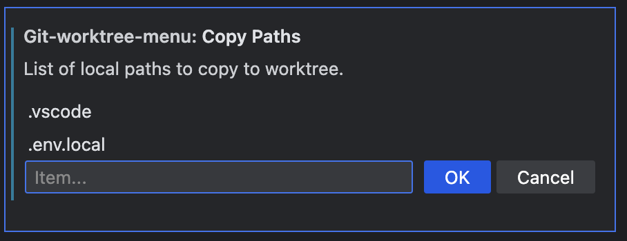

# git Worktree Menu

## Features

Quickly and easily create and switch between worktrees.

Worktrees are a core feature of Git that allow you to have multiple folders on your computer, each open to different branches of your repository. This extension lets you easily manage these worktrees using a new menu under the Source Control activity bar. Create, open or switch worktrees with ease!

New in version 1.0.6: Bring your configuration files along for the ride!

Configure a list of paths (files or folders) that will be copied from the current worktree when present to newly created worktrees. A quick way to bring along your .env files or other untracked configuration files.

## Release Notes

### 1.0.7

Introduce extension logo and update readme

### 1.0.6

Configure list of paths to copy in new worktree - [@SR_team](https://github.com/sr-tream)

### 1.0.5

Fix "separate" typo

### 1.0.4

Start select parent folder from workspace directory and keep last worktree directory path (runtime only) - [@SR_team](https://github.com/sr-tream)

### 1.0.3

Do not show bare copy of submodules in worktree list - [@SR_team](https://github.com/sr-tream)

### 1.0.2

fixes a crash when workspace is open to a bare git repo - [@kryyova](https://github.com/kryyova)

### 1.0.1

Added support for remote branches

### 1.0.0

Initial release
