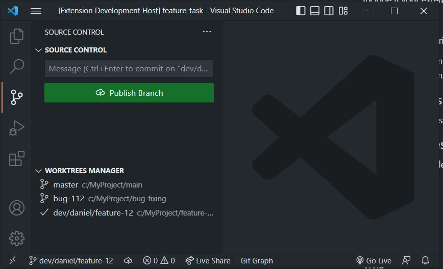

# git Worktree Menu

## Features

Quickly and easily create and switch between worktrees.

Worktrees are a core feature of git. You can use this feature when you want to have multiple folders on your computer open to different branches of your repo. Switch branches without needing to commit or stash your work in progress changes by using folders.

---
## Release Notes

### 1.0.0

Initial release

